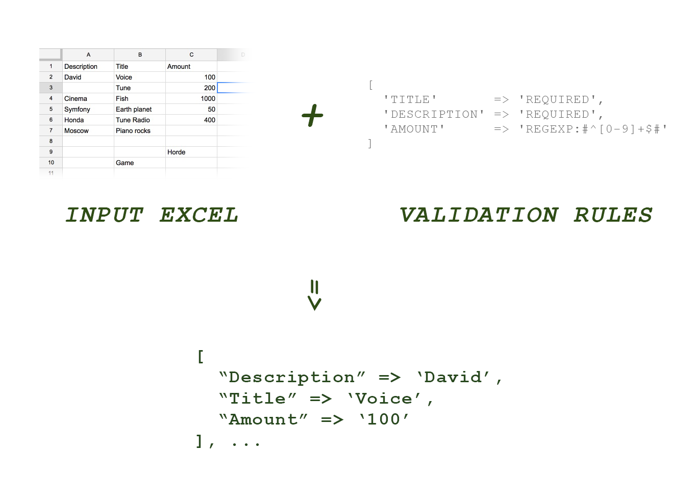

[](https://packagist.org/packages/lezhnev74/eximport)
[](https://packagist.org/packages/lezhnev74/eximport)
[](https://packagist.org/packages/lezhnev74/eximport)
[](https://packagist.org/packages/lezhnev74/eximport)


# Eximporter
Object oriented Excel importer with input validation
It lets you to import any excel file, validate each cell and do your business logic with good and failed ones.

P.s. It will automatically skip rows with all nulls in cells.



## Example
```php
use Eximporter\Eximporter;
use Eximporter\Exceptions\BadFile;


$file     = "./tests/resources/test_05.xlsx";
try {
    $importer = new Eximporter($file);
    
    $importer->setValidationRules([
        // you can set rules by names
        'description' => 'required',
        // you can set manual closures as rules (as an array)
        'amount'      => ['custom_rule' => function($cellvalue){ return $cell_value > 100; }]
         // you can add few rules in a row
         'title'      => [
                'required|regexp:#^[0-9]+$#', 
                [
                    'custom_rule_2' => function($cell_value) { return strlen($cell_value)<10; }
                ]
         ],
    ]);
    
    
    // set handlers (closures) to handle each good or bad (validation failed) row
    $importer->setHandlerForBadRow(function ($row, $bad_cells) {
        foreach ($bad_cells as $cell_title => $validation_result) {
            echo $cell_title . " failed validators: " . implode(", ", $validation_result->getFailed());
            echo "\n";
            
            // example output:
            // Amount failed validators: custom1
            // Description failed validators: required
            // ...
        }
    });
    
    // set handlers for good rows
    $importer->setHandlerForGoodRow(function ($row) {
        // business logic with $row
    });
    
    
    // ok let's go
    $importer->read();
    
    // you can access counters
    echo $importer->getGoodRowsCount();
    echo $importer->getBadRowsCount();
    
} catch (BadFile $e) {
    // unable to open this file
}


```

## Usage
This package is intended to be used in projects with Excel import functions.
It let's you easily add a validation layer and filtering options for your data. 
It is based on Phpoffice/phpexcel under the hood.

## Credits
Dmitriy Lezhnev
lezhnev.work@gmail.com